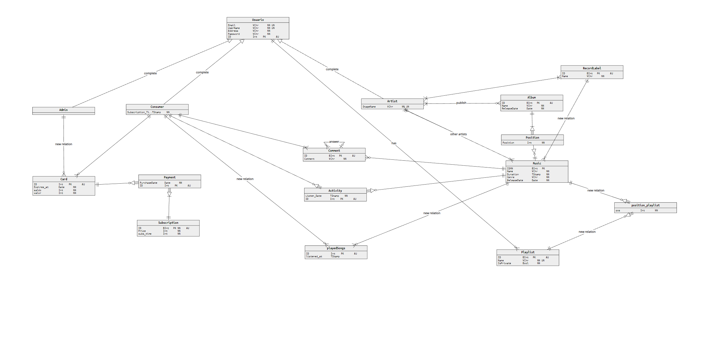
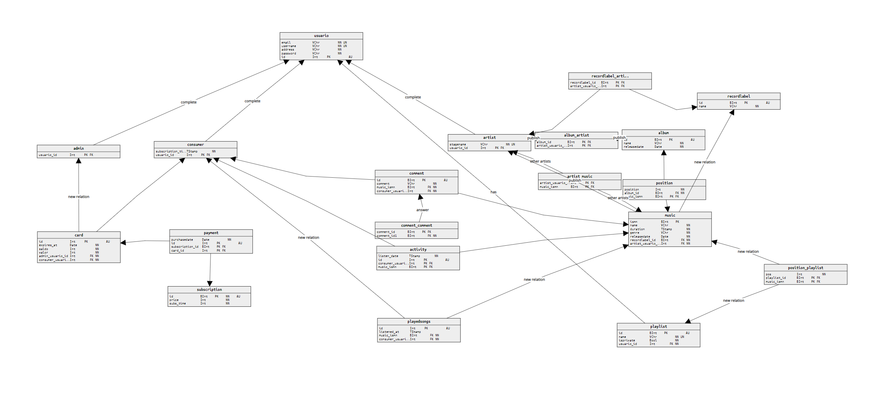

# Harmonic-Stream-BD

**Harmonic-Stream-BD** is a music streaming platform designed to offer a smooth experience in managing music and playlists. This project was developed with a focus on a scalable, secure system integrated with a relational database, following best software development practices.

## Project Overview

This project includes three main types of users:
- **Consumers**: can listen to music, create playlists, and subscribe to premium services.
- **Artists**: can upload songs and albums.
- **Administrators**: manage users and the system.

The project uses a RESTful architecture for the API and a relational database to store information about music, playlists, and users.

## Conceptual Diagram



This diagram represents the overall architecture of the system, showing the relationships between different entities in the database and how they interact.

## Physical Diagram



The physical diagram details the implementation of the database, including tables and relationships between them.

## Project Organization

The project is organized as follows:

### 1. **`/src`** 
   Contains the application source code and main scripts:
   - `demo-api.py`: The main API code that connects the application to the database.
   - `FINAL_1.json`: Example data that can be loaded into the database.

### 2. **`/setup`**
   Contains scripts and configuration files used to set up the database and application:
   - `CREATE_TRIGGERS.txt`: SQL script to create triggers in the database.
   - `SETUP.txt`: Script to set up the database and create the initial administrator.
   - `projeto.postman_collection.json`: A Postman collection with example requests for the API.

### 3. **`/docs`**
   Contains documentation and diagrams related to the project:
   - `Programmer's Manual - DB (1).pdf`: Complete manual explaining the system's functionality and how to use it.
   - `Conceptual.png`: Conceptual diagram of the system architecture.
   - `Physical.png`: Physical diagram of the database.

### 4. **`/logs`**
   Contains log files:
   - `log_file.log`: Log generated by the application.

### 5. **`LICENSE`**
   The project’s license file, under the **MIT License**, allowing others to use and modify the code as long as proper credit is given.

## How to Set Up the Project

### Prerequisites
- Python 3.x
- PostgreSQL
- pgAdmin4
- Postman

### Setup Steps

1. **Set up the database**:
   - Open **pgAdmin4** and start a server.
   - Run the `SETUP.txt` script to create the tables and the initial administrator.
   - Run the `CREATE_TRIGGERS.txt` script to configure the triggers in the database.

2. **Set up the Python application**:
   - Add your database credentials to the `demo-api.py` file.
   - Run the application with the following command:
     ```bash
     python demo-api.py
     ```

3. **Test the API**:
   - Use **Postman** to test the available endpoints.

## Key Features

- **User management**: Creation and login of consumers, artists, and administrators.
- **Music management**: Uploading songs and albums by artists.
- **Playlists**: Creation and management of playlists by consumers.
- **Subscriptions**: Consumers can purchase premium subscriptions using prepaid cards generated by administrators.
